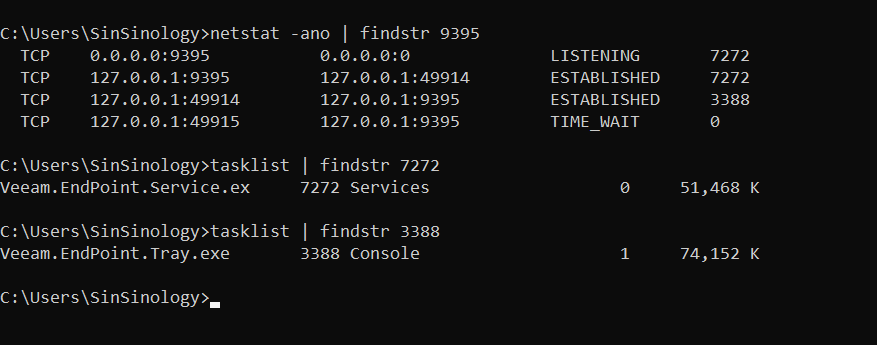
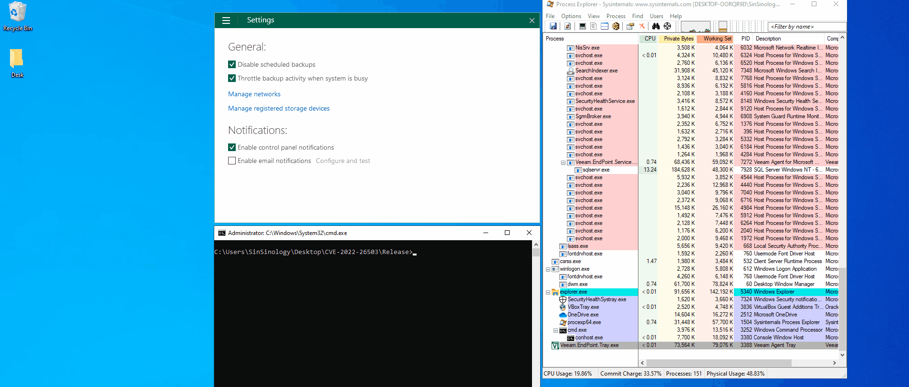

# CVE-2022-26503

## Summary:

Vulnerability (CVE-2022-26503) in Veeam Agent *for Microsoft Windows* allows local privilege escalation. An attacker who successfully exploited this vulnerability could run arbitrary code with LOCAL SYSTEM privileges.

Shout out to @ultrayoba

## The Patch:

The implemented patch shows blood trail of Deserialization:

**Veeam official KB mentions:**

> Veeam Agent *for Microsoft Windows* uses Microsoft .NET data serialization mechanisms. A local user may send malicious code to the network port opened by Veeam Agent for Windows Service *(TCP 9395 by default),* which will not be deserialized properly.
> 

## Analysis:

Reviewing process behind the specified port results in finding `Veeam.EndPoint.Service.exe`

Reviewing `Veeam.EndPoint.Service.exe` indicates registration of `VeeamService` for .NET Remoting

Processes communicating with the registered channel gives out information about `Veeam.EndPoint.Tray.exe` showing this channel gets used by Tray process

Loaded modules by the Tray indicate `Veeam.Common.Remoting.dll`

Use of `TcpClientChannel` with enabled `Secure`

## Exploit:

